# Σύστημα Διαχείρισης Βιομηχανικών Αποθηκών

Αυτή η εργασία παρουσιάζει ένα ολοκληρωμένο πληροφοριακό σύστημα για τη διαχείριση βιομηχανικών αποθηκών. Το σύστημα αναπτύχθηκε στο πλαίσιο του μαθήματος "Πληροφοριακά Συστήματα" και υλοποιήθηκε με τη χρήση σύγχρονων τεχνολογιών όπως Flask, MongoDB και Docker.

## Περιεχόμενα

- [Επιπλέον Παραδοχές και Παρεκκλίσεις](#επιπλέον-παραδοχές-και-παρεκκλίσεις)
- [Τεχνολογίες που Χρησιμοποιήθηκαν](#τεχνολογίες-που-χρησιμοποιήθηκαν)
- [Περιγραφή Αρχείων](#περιγραφή-αρχείων)
- [Βάση Δεδομένων](#βάση-δεδομένων)
- [Τρόπος Εκτέλεσης](#τρόπος-εκτέλεσης)
- [Τρόπος Χρήσης](#τρόπος-χρήσης)
- [Screenshots του Συστήματος](#screenshots-του-συστήματος)
- [Αναφορές](#αναφορές)

## Επιπλέον Παραδοχές και Παρεκκλίσεις από την Εκφώνηση

Κατά την ανάπτυξη του συστήματος έγιναν κάποιες παραδοχές σχεδιασμού που θεωρώ σκόπιμο να αναφέρω:

### Παραδοχές που υιοθετήθηκαν

Στην πορεία ανάπτυξης του συστήματος προέκυψε η ανάγκη να πάρω κάποιες αποφάσεις σχεδιασμού:

1. **Ιεραρχία ρόλων**: Θεώρησα ότι οι Supervisors είναι επίσης Employees σύμφωνα με την εκφώνηση
2. **Αυτόματη αρίθμηση προϊόντων**: Τα Product IDs δημιουργούνται αυτόματα με μορφή "P0001", "P0002", κτλ.
3. **Αυτόματη αρίθμηση αποθηκών**: Τα Unit IDs δημιουργούνται αυτόματα ως "001", "002", κτλ.
4. **Διαχωρισμός κερδών**: Υπολογίζω ξεχωριστά τα πραγματοποιηθέντα και τα δυνητικά κέρδη
5. **Υπολογισμός όγκου**: Ο όγκος αποθήκης υπολογίζεται ως άθροισμα των product_volume × product_quantity

### Επιπλέον χαρακτηριστικά που προσέθεσα

Πέραν των βασικών απαιτήσεων, προσέθεσα μερικά χαρακτηριστικά που θεώρησα χρήσιμα:

- **Σύγχρονο interface**: Χρησιμοποίησα Bootstrap 5 για καλύτερη εμπειρία χρήστη
- **Γραφήματα**: Ενσωμάτωσα Chart.js για οπτικοποίηση των δεδομένων
- **Real-time ενημερώσεις**: Τα δεδομένα ενημερώνονται αυτόματα
- **Ενισχυμένη ασφάλεια**: Χρήση bcrypt για τους κωδικούς και session management
- **Βελτιστοποιήσεις απόδοσης**: Database indexing και βελτιστοποιημένα queries
- **Ανάλυση δεδομένων**: Υπολογισμοί ROI και profit margins
- **Responsive σχεδίαση**: Mobile-friendly interface

### Παρεκκλίσεις

Δεν υπάρχουν παρεκκλίσεις από την εκφώνηση - όλες οι απαιτήσεις καλύπτονται πλήρως.

## Τεχνολογίες που Χρησιμοποιήθηκαν

Η επιλογή των τεχνολογιών έγινε με βάση τις απαιτήσεις του μαθήματος και τη σύγχρονη πρακτική ανάπτυξης web εφαρμογών.

### Backend τεχνολογίες
- **Python 3.9**: Κύρια γλώσσα προγραμματισμού
- **Flask 2.3.3**: Lightweight web framework για το REST API
- **PyMongo 4.5.0**: MongoDB driver για Python
- **bcrypt 4.0.1**: Για ασφαλή κρυπτογράφηση κωδικών
- **python-dotenv 1.0.0**: Διαχείριση environment variables

### Frontend τεχνολογίες
- **Jinja2**: Template engine (ενσωματωμένο στο Flask)
- **Bootstrap 5.3.0**: CSS framework για responsive σχεδίαση
- **Chart.js 3.9.1**: JavaScript library για δημιουργία διαγραμμάτων
- **Font Awesome 6.4.0**: Icon library για το UI

### Database
- **MongoDB 5.0**: NoSQL document database
- **Hybrid Schema Design**: Συνδύασα σχεσιακή και μη-σχεσιακή προσέγγιση

### DevOps εργαλεία
- **Docker**: Για containerization της εφαρμογής
- **Docker Compose**: Multi-container orchestration
- **Docker Volume**: Διατήρηση δεδομένων

## Περιγραφή Αρχείων

Όταν ξεκίνησα το project, σκέφτηκα να το οργανώσω με τρόπο που να μπορώ εύκολα να βρίσκω τα αρχεία και να προσθέτω νέες λειτουργίες μετά.

Βασικά έχω αυτή τη δομή:

- **compose.yaml** και **Dockerfile**: Για το Docker setup
- **requirements.txt**: Όλα τα Python packages που χρειάζομαι
- **data/**: Εδώ αποθηκεύονται τα δεδομένα της MongoDB
- **app/**: Όλος ο κώδικας Python

Μέσα στο **app/** χώρισα τον κώδικα σε αρχεία ανάλογα με το τι κάνουν:

- **main.py**: Το κυρίως Flask app με τα βασικά routes (login, logout, κλπ)
- **database.py**: Όλη η δουλειά με τη MongoDB (σύνδεση, indexes, κλπ)
- **models.py**: Οι κλάσεις που χειρίζονται users, products, units
- **admin_routes.py**: Routes που μπορεί να χρησιμοποιήσει μόνο ο admin
- **supervisor_routes.py**: Routes για supervisors
- **employee_routes.py**: Routes για employees

Για τα **templates/**, τα χώρισα σε φακέλους:
- **admin/**: Όλες οι σελίδες που βλέπει ο admin
- **supervisor/**: Σελίδες για supervisors  
- **employee/**: Σελίδες για employees

Και μετά έχω μερικές κοινές σελίδες όπως το **login.html**, **profile.html**, κλπ που τις βλέπουν όλοι.

Στο **static/** έχω τα CSS, JavaScript και εικόνες.

### Οργάνωση κώδικα

Χώρισα τη λειτουργικότητα σε διαφορετικά modules για καλύτερη οργάνωση:

#### `main.py`
Κύριο αρχείο εφαρμογής που περιέχει:
- Flask app initialization
- Session management
- Authentication & authorization
- Common routes (login, logout, profile, password change)
- Role-based access control

#### `database.py`
Διαχείριση βάσης δεδομένων:
- MongoDB connection setup
- Database indexes creation
- Default admin user creation
- Connection management

#### `models.py`
Business logic & data models:
- UserModel: User management (CRUD operations)
- UnitModel: Warehouse management
- ProductModel: Product management & financial calculations
- TransactionModel: Transaction logging

#### Route Files
- `admin_routes.py`: Admin-specific functionality
- `supervisor_routes.py`: Supervisor-specific functionality  
- `employee_routes.py`: Employee-specific functionality

## Βάση Δεδομένων

Για τη βάση δεδομένων επέλεξα MongoDB λόγω της ευελιξίας που παρέχει σε σχέση με τα παραδοσιακά σχεσιακά συστήματα. Ταυτόχρονα όμως διατήρησα μία δομή που θυμίζει σχεσιακό μοντέλο για ευκολότερη κατανόηση.

### Collections που δημιούργησα

#### 1. `users` Collection
```javascript
{
  "_id": ObjectId,
  "username": "string",           // Unique username
  "password": "hashed_string",    // Bcrypt hashed password
  "name": "string",              // First name
  "surname": "string",           // Last name
  "role": "admin|supervisor|employee",
  "unit_id": "string|null",      // Associated warehouse (null for admin)
  "employee_username": "string", // Same as username (legacy field)
  "employee_name": "string",     // Full name
  "employee_unit": "string",     // Same as unit_id (legacy field)
  "employee_phone": "string",    // Phone number
  "employee_email": "string",    // Email address
  "employee_address": "string",  // Address
  "last_login": Date,           // Last login timestamp
  "created_at": Date,           // Creation timestamp
  "updated_at": Date            // Last update timestamp
}
```

**Παράδειγμα:**
```javascript
{
  "_id": ObjectId("64f8a1b2c3d4e5f6a7b8c9d0"),
  "username": "admin",
  "password": "$2b$12$...", // bcrypt hash
  "name": "System",
  "surname": "Administrator",
  "role": "admin",
  "unit_id": null,
  "created_at": ISODate("2025-09-17T10:00:00Z")
}
```

#### 2. `units` Collection
```javascript
{
  "_id": ObjectId,
  "unit_id": "string",           // Unique unit identifier (001, 002, etc.)
  "unit_name": "string",         // Warehouse name
  "unit_volume": Number,         // Total storage volume (m³)
  "created_at": Date,           // Creation timestamp
  "updated_at": Date            // Last update timestamp
}
```

**Παράδειγμα:**
```javascript
{
  "_id": ObjectId("64f8a1b2c3d4e5f6a7b8c9d1"),
  "unit_id": "001",
  "unit_name": "Αποθήκη Κεντρικής Αθήνας",
  "unit_volume": 1000.0,
  "created_at": ISODate("2025-09-17T10:30:00Z")
}
```

#### 3. `products_master` Collection
```javascript
{
  "_id": ObjectId,
  "product_id": "string",            // Unique product ID (P0001, P0002, etc.)
  "product_name": "string",          // Product name
  "product_weight": Number,          // Weight per unit (kg)
  "product_volume": Number,          // Volume per unit (m³)
  "product_category": "string",      // Product category
  "product_purchase_price": Number,  // Purchase price per unit (€)
  "product_selling_price": Number,   // Selling price per unit (€)
  "product_manufacturer": "string"   // Manufacturer name
}
```

**Παράδειγμα:**
```javascript
{
  "_id": ObjectId("64f8a1b2c3d4e5f6a7b8c9d2"),
  "product_id": "P0001",
  "product_name": "Laptop Dell Inspiron",
  "product_weight": 2.5,
  "product_volume": 0.008,
  "product_category": "Ηλεκτρονικά",
  "product_purchase_price": 500.00,
  "product_selling_price": 650.00,
  "product_manufacturer": "Dell"
}
```

#### 4. `unit_products` Collection
```javascript
{
  "_id": ObjectId,
  "unit_id": "string",              // Reference to units.unit_id
  "product_id": "string",           // Reference to products_master.product_id
  "product_quantity": Number,       // Current stock quantity
  "product_unit_gain": Number       // Total profit/loss for this product in this unit
}
```

**Παράδειγμα:**
```javascript
{
  "_id": ObjectId("64f8a1b2c3d4e5f6a7b8c9d3"),
  "unit_id": "001",
  "product_id": "P0001",
  "product_quantity": 25,
  "product_unit_gain": 750.00    // 5 units sold × (650-500) profit = 750€
}
```

#### 5. `transactions` Collection
```javascript
{
  "_id": ObjectId,
  "unit_id": "string",              // Warehouse where transaction occurred
  "product_id": "string",           // Product involved
  "transaction_type": "sale|purchase", // Type of transaction
  "quantity": Number,               // Quantity involved
  "unit_price": Number,            // Price per unit
  "total_amount": Number,          // Total transaction amount
  "performed_by": "string",        // Username who performed the transaction
  "timestamp": Date,               // Transaction timestamp
  "notes": "string"                // Additional notes
}
```

**Παράδειγμα:**
```javascript
{
  "_id": ObjectId("64f8a1b2c3d4e5f6a7b8c9d4"),
  "unit_id": "001",
  "product_id": "P0001",
  "transaction_type": "sale",
  "quantity": 2,
  "unit_price": 650.00,
  "total_amount": 1300.00,
  "performed_by": "employee1",
  "timestamp": ISODate("2025-09-18T14:30:00Z"),
  "notes": "Πώληση σε εταιρικό πελάτη"
}
```

### Database Indexes για βελτίωση απόδοσης

Δημιούργησα κατάλληλα indexes για γρηγορότερες αναζητήσεις:
```javascript
// Users collection
db.users.createIndex({"username": 1}, {unique: true})
db.users.createIndex({"unit_id": 1})

// Units collection  
db.units.createIndex({"unit_id": 1}, {unique: true})

// Products master collection
db.products_master.createIndex({"product_id": 1}, {unique: true})
db.products_master.createIndex({"product_name": 1})

// Unit products collection
db.unit_products.createIndex({"unit_id": 1, "product_id": 1}, {unique: true})
db.unit_products.createIndex({"unit_id": 1})

// Transactions collection
db.transactions.createIndex({"unit_id": 1})
db.transactions.createIndex({"product_id": 1})
db.transactions.createIndex({"timestamp": -1})
```

## Τρόπος Εκτέλεσης Συστήματος

Για να τρέξει το σύστημα χρειάζεται να ακολουθήσετε τα παρακάτω βήματα. Επέλεξα το Docker για να κάνω εύκολη την εγκατάσταση και εκτέλεση.

### Τι χρειάζεστε πρώτα

1. **Docker & Docker Compose**: Κατεβάστε το Docker Desktop από το official site
2. **Git**: Για να κατεβάσετε τον κώδικα
3. **Ελεύθερα ports**: Τα ports 5000 και 27017 πρέπει να είναι ελεύθερα

### Βήματα για εκτέλεση

#### 1. Κατέβασμα του κώδικα
```bash
git clone https://github.com/savvaskassas/YpoxreotikiErgasiaSept25_-20067_KASSAS_SAVVAS.git
cd YpoxreotikiErgasiaSept25_-20067_KASSAS_SAVVAS/logistics-warehouse-system
```

#### 2. Εκτέλεση με Docker
```bash
docker compose up -d --build
```

Αυτή η εντολή:
- Χτίζει τα Docker images
- Ξεκινά τα containers στο background
- Δημιουργεί τη βάση δεδομένων αυτόματα

#### 3. Έλεγχος ότι όλα δουλεύουν
```bash
docker compose ps
```

#### 4. Χρήση του συστήματος
- Ανοίξτε τον browser στο http://localhost:5000
- Συνδεθείτε ως admin:
  - Username: `admin`
  - Password: `admin123`

### Χρήσιμες εντολές

#### Για να σταματήσετε το σύστημα
```bash
docker compose down
```

#### Για restart
```bash
docker compose restart
```

#### Για να δείτε τα logs
```bash
docker compose logs web
```

## Τρόπος Χρήσης Συστήματος

Στην ενότητα αυτή παρουσιάζω πώς χρησιμοποιείται το σύστημα από κάθε τύπο χρήστη. Κάθε ένας από τους τρεις ρόλους (Admin, Supervisor, Employee) έχει διαφορετικές δυνατότητες.

**Σημείωση**: Αντίστοιχα screenshots βρίσκονται στην επόμενη ενότητα.

### 1. Σύνδεση στο Σύστημα

#### Διαχειριστές (Administrators)
Για πρώτη φορά:
1. Πηγαίνετε στο http://localhost:5000
2. Χρησιμοποιήστε:
   - **Username**: `admin`
   - **Password**: `admin123`

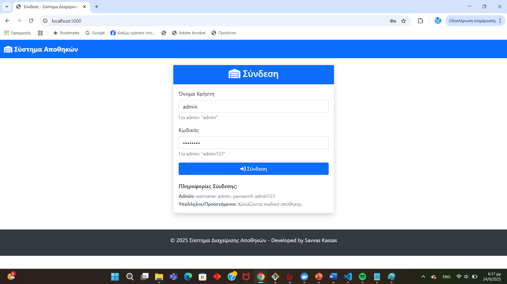
*Σελίδα σύνδεσης διαχειριστή*

#### Προϊστάμενοι και Υπάλληλοι
Πρέπει πρώτα ο admin να δημιουργήσει τους λογαριασμούς τους. Μετά συνδέονται με:
- Unit ID (π.χ. "001")
- Username
- Password

### 2. Λειτουργίες Διαχειριστή (Admin)

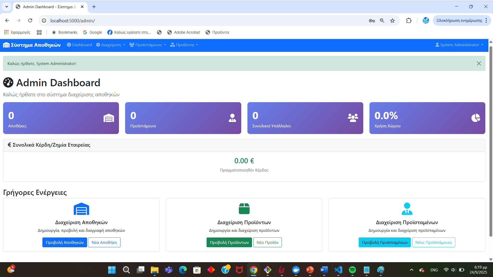
*Το κεντρικό dashboard του διαχειριστή με όλες τις επιλογές διαχείρισης*

#### Δημιουργία Αποθήκης
1. Από το Admin Dashboard πατάτε "Διαχείριση" → "Νέα Αποθήκη"
2. Συμπληρώνετε:
   - Όνομα αποθήκης (π.χ. "Αποθήκη Θεσσαλονίκης")
   - Συνολικό όγκος σε κυβικά μέτρα (π.χ. 1500)
3. Το σύστημα δίνει αυτόματα ένα unit_id (π.χ. "002")

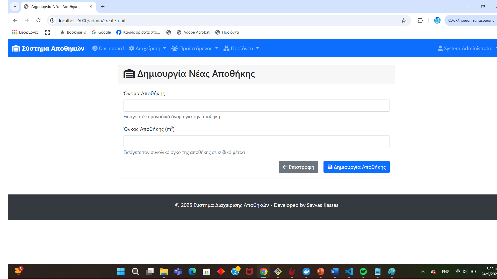
*Φόρμα δημιουργίας νέας αποθήκης*

#### Δημιουργία Προϊόντος
1. "Προϊόντα" → "Νέο Προϊόν"
2. Συμπληρώνετε όλα τα στοιχεία όπως:
   - Όνομα προϊόντος
   - Βάρος και όγκος ανά τεμάχιο
   - Κατηγορία
   - Τιμές αγοράς και πώλησης
   - Κατασκευαστής
   - Αρχική ποσότητα για όλες τις αποθήκες

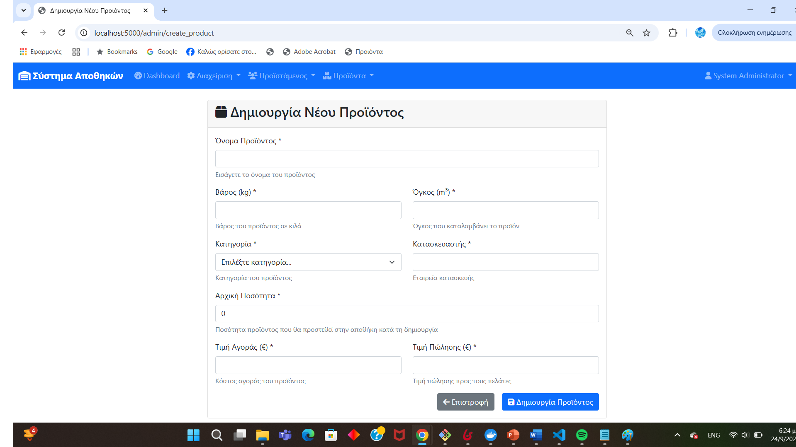
*Φόρμα δημιουργίας νέου προϊόντος*

#### Δημιουργία Προϊσταμένου
1. "Προϊστάμενοι" → "Νέος Προϊστάμενος"
2. Επιλέγετε σε ποια αποθήκη θα εργάζεται
3. Συμπληρώνετε προσωπικά στοιχεία και κωδικό

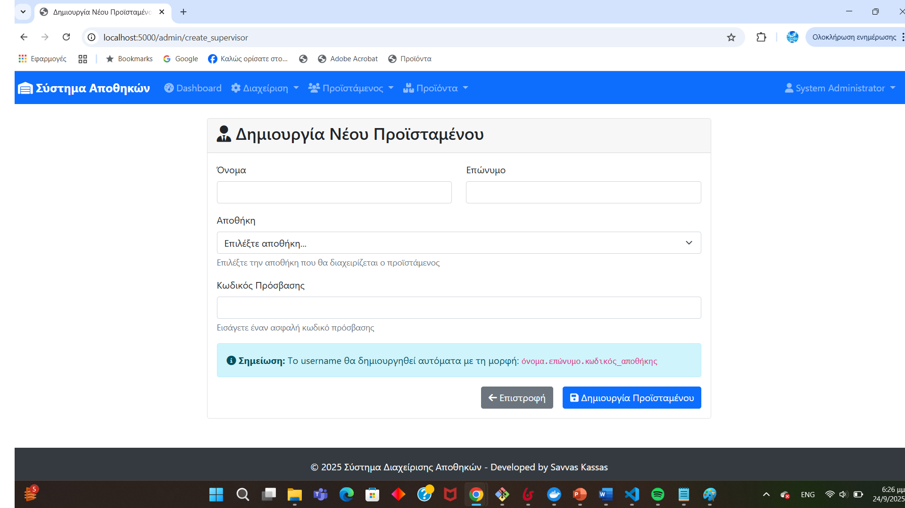
*Φόρμα δημιουργίας νέου προϊσταμένου*

#### Προβολή Στατιστικών
Στο dashboard βλέπετε:
- Συνολικά κέρδη όλης της εταιρείας
- Χρήση όγκου αποθηκών
- Αριθμό εργαζομένων
- Διαγράμματα κατανομής

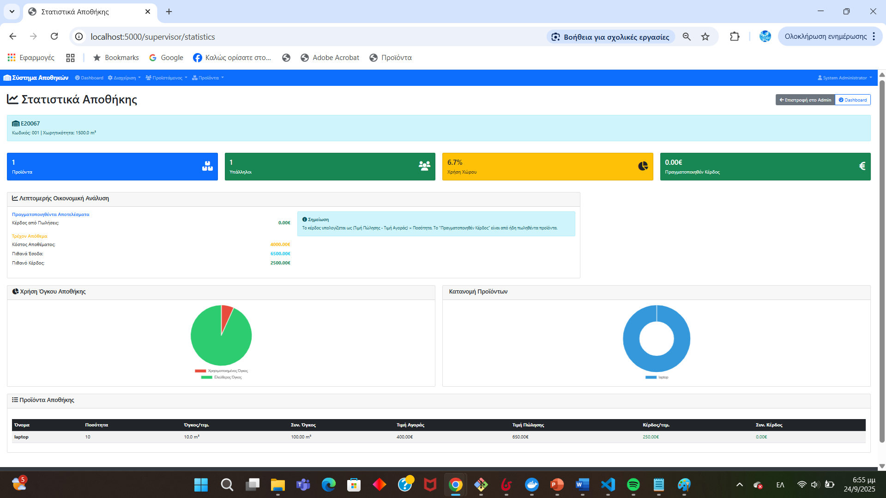
*Σελίδα στατιστικών με διαγράμματα απόδοσης*

### 3. Λειτουργίες Προϊσταμένου (Supervisor)

#### Διαχείριση Υπαλλήλων
1. "Υπάλληλοι" → "Νέος Υπάλληλος" για δημιουργία
2. Μπορείτε να αλλάξετε κωδικούς υπαλλήλων
3. Βλέπετε λίστα όλων των υπαλλήλων της αποθήκης σας

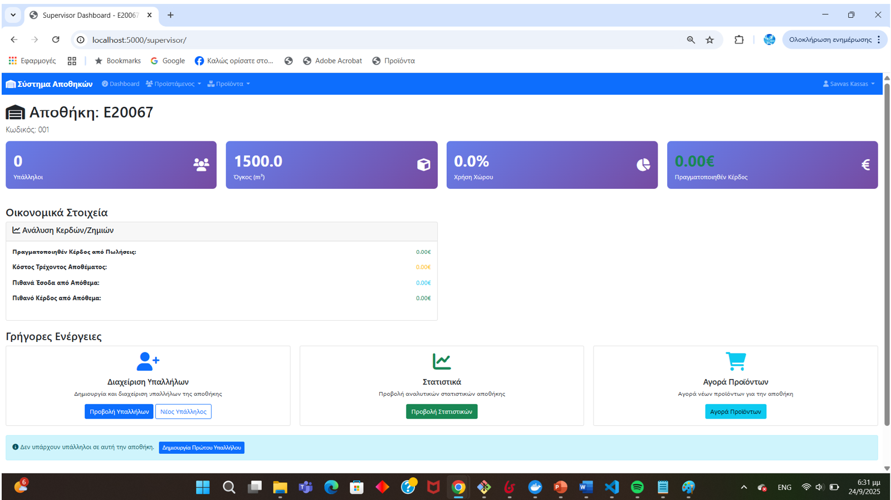
*Διαχείριση υπαλλήλων από προϊστάμενο*

#### Αγορά Προϊόντων
1. Πηγαίνετε στα "Προϊόντα"
2. Επιλέγετε ένα προϊόν και πατάτε "Αγορά"
3. Βάζετε την ποσότητα που θέλετε να αγοράσετε
4. Το απόθεμα αυξάνεται αυτόματα

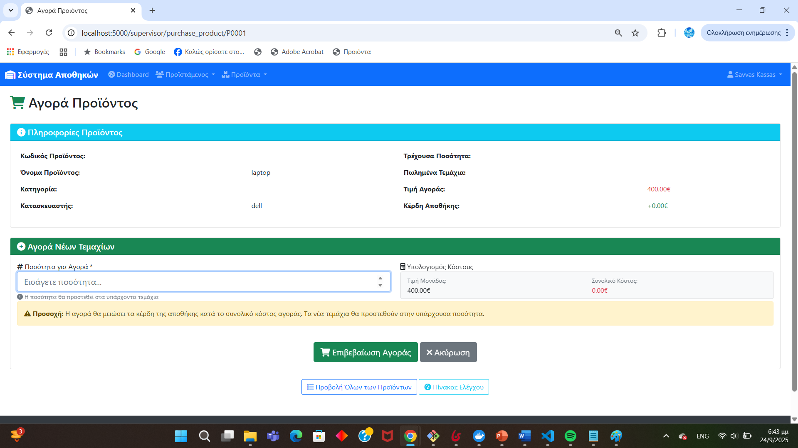
*Φόρμα αγοράς προϊόντων για συμπλήρωση αποθέματος*

#### Στατιστικά Αποθήκης
Βλέπετε:
- Κέρδη της αποθήκης σας
- Πόσο όγκο χρησιμοποιείτε
- Αριθμό υπαλλήλων
- Διαγράμματα με ανάλυση κερδών

### 4. Λειτουργίες Υπαλλήλου (Employee)


*Το κεντρικό dashboard του υπαλλήλου με διαθέσιμα προϊόντα*

#### Προβολή και Αναζήτηση Προϊόντων
1. Στο "Employee Dashboard" βλέπετε όλα τα προϊόντα της αποθήκης σας
2. Μπορείτε να αναζητήσετε προϊόντα με:
   - Όνομα προϊόντος
   - Product ID
   - Κατηγορία
   - Εύρος ποσοτήτων

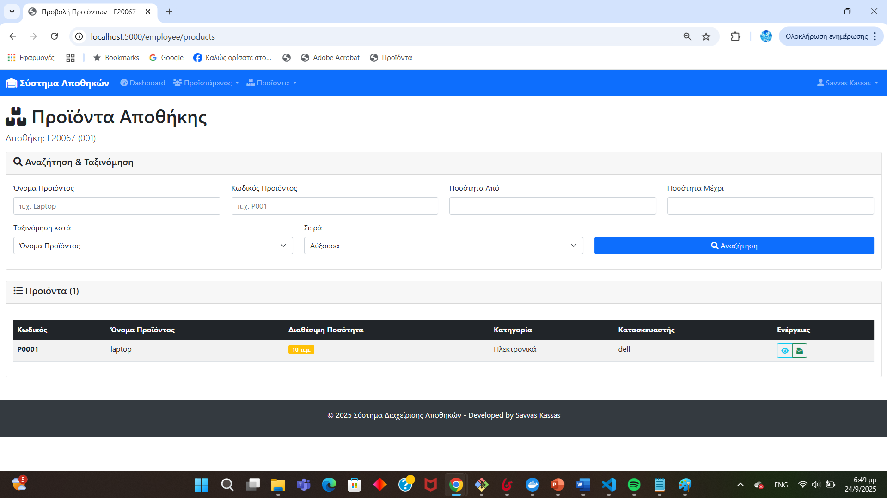
*Αναζήτηση προϊόντων με φίλτρα*

#### Πώληση Προϊόντων
1. Επιλέγετε ένα προϊόν
2. Πατάτε "Πώληση"
3. Βάζετε πόσα τεμάχια θέλετε να πουλήσετε
4. Το σύστημα:
   - Ελέγχει αν υπάρχει αρκετό απόθεμα
   - Μειώνει την ποσότητα
   - Υπολογίζει και προσθέτει το κέρδος

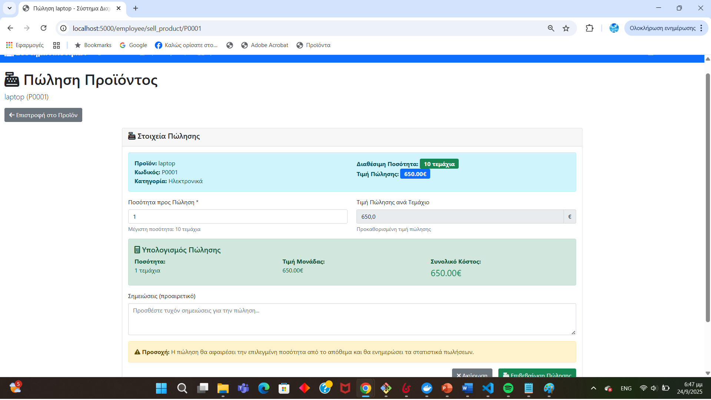
*Φόρμα πώλησης προϊόντος με αυτόματους υπολογισμούς*

#### Λεπτομέρειες Προϊόντων
Για κάθε προϊόν μπορείτε να δείτε:
- Όλες τις τεχνικές προδιαγραφές
- Τρέχουσα ποσότητα
- Τιμές
- Πιθανό κέρδος αν πουληθούν όλα

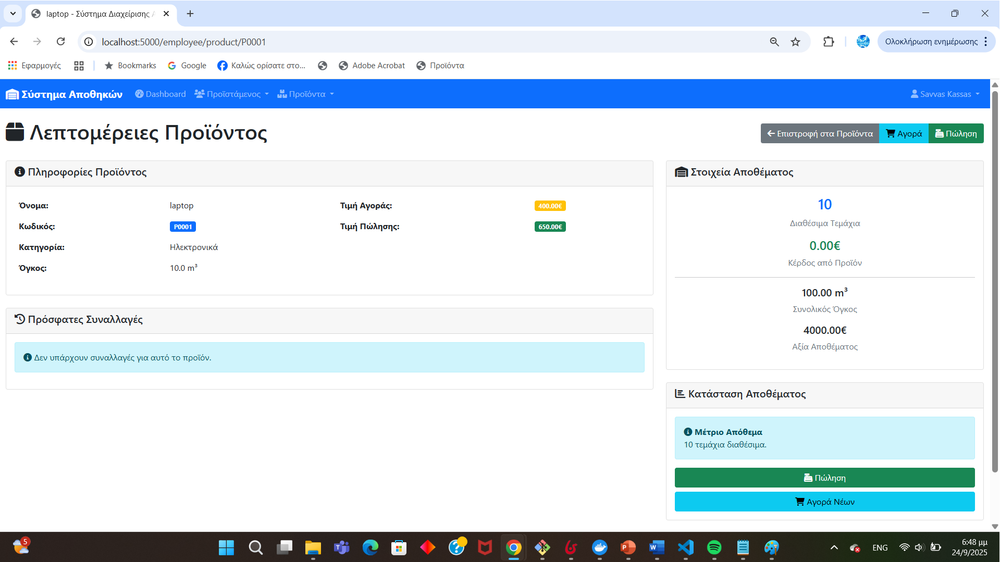
*Σελίδα λεπτομερειών προϊόντος*

### 5. Γενικές Λειτουργίες

#### Αλλαγή Κωδικού
1. Πατάτε στο όνομά σας πάνω δεξιά
2. "Αλλαγή Κωδικού"
3. Βάζετε τον παλιό και δύο φορές τον νέο κωδικό

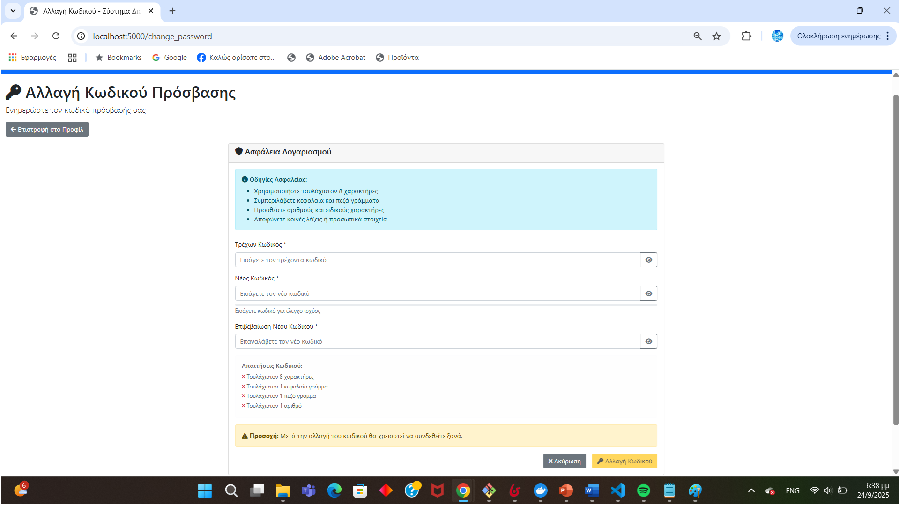
*Φόρμα αλλαγής κωδικού*

#### Ενημέρωση Προφίλ
Μπορείτε να αλλάξετε:
- Τηλέφωνο
- Email
- Διεύθυνση

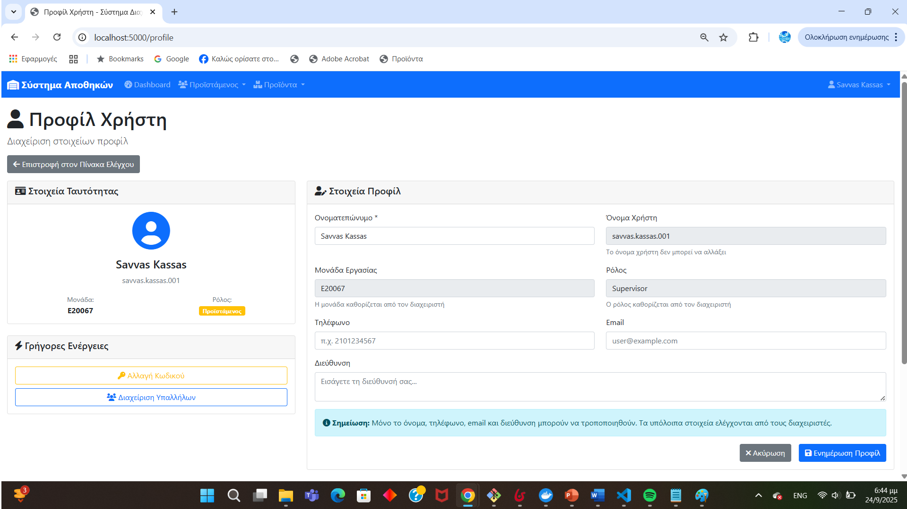
*Σελίδα ενημέρωσης προσωπικών στοιχείων*

### 6. Παραδείγματα χρήσης

#### Τυπική ημέρα ενός Supervisor:
1. Συνδέεται στο σύστημα
2. Ελέγχει τα στατιστικά της αποθήκης του
3. Βλέπει ότι κάποια προϊόντα είναι λίγα
4. Κάνει παραγγελία (αγορά) για να συμπληρώσει το απόθεμα
5. Ελέγχει αν χρειάζεται να δημιουργήσει νέο λογαριασμό υπαλλήλου

#### Τυπική ημέρα ενός Employee:
1. Συνδέεται στο σύστημα
2. Βλέπει τα διαθέσιμα προϊόντα
3. Όταν έρχεται πελάτης, αναζητά το προϊόν που θέλει
4. Κάνει την πώληση μέσω του συστήματος
5. Το απόθεμα ενημερώνεται αυτόματα

## Screenshots του Συστήματος

Στα screenshots που ακολουθούν μπορείτε να δείτε την πραγματική εμφάνιση και χρήση του συστήματος:

### Login Screen

*Η σελίδα σύνδεσης όπου οι χρήστες εισάγουν τα στοιχεία τους*

### Admin Dashboard
  
*Το κεντρικό dashboard του διαχειριστή με στατιστικά και επιλογές διαχείρισης*

### Admin - Δημιουργία Αποθήκης

*Η φόρμα δημιουργίας νέας αποθήκης*

### Admin - Διαχείριση Προϊόντων

*Λίστα όλων των προϊόντων με επιλογές επεξεργασίας*

### Admin - Δημιουργία Προϊσταμένου

*Φόρμα για δημιουργία νέου λογαριασμού προϊσταμένου*

### Supervisor Dashboard  

*Το dashboard του προϊσταμένου με στατιστικά της αποθήκης του*

### Supervisor - Αγορά Προϊόντων

*Σελίδα αγοράς προϊόντων για συμπλήρωση αποθέματος*

### Supervisor - Διαχείριση Υπαλλήλων

*Λίστα υπαλλήλων της αποθήκης με επιλογές διαχείρισης*

### Employee Dashboard

*Το κεντρικό dashboard του υπαλλήλου με διαθέσιμα προϊόντα*

### Employee - Πώληση Προϊόντος

*Φόρμα πώλησης προϊόντος με αυτόματους υπολογισμούς*

### Employee - Αναζήτηση Προϊόντων

*Σελίδα αναζήτησης με φίλτρα και ταξινόμηση*

### Στατιστικά και Διαγράμματα

*Σελίδα στατιστικών με διαγράμματα απόδοσης*

### Mobile Responsive Design

*Το σύστημα σε mobile συσκευή - responsive design*

**Σημείωση**: Τα screenshots δείχνουν την πραγματική λειτουργία του συστήματος με δεδομένα δοκιμής. Όλες οι λειτουργίες που περιγράφονται στο documentation είναι πλήρως υλοποιημένες και λειτουργικές.

## Αναφορές

Κατά την ανάπτυξη της εργασίας χρησιμοποίησα τις παρακάτω πηγές για να μάθω τις τεχνολογίες και να λύσω προβλήματα:

### Επίσημη τεκμηρίωση τεχνολογιών
1. **Flask Documentation**: https://flask.palletsprojects.com/ - Για το web framework
2. **MongoDB Manual**: https://docs.mongodb.com/ - Για τη βάση δεδομένων  
3. **Docker Documentation**: https://docs.docker.com/ - Για containerization
4. **Bootstrap Documentation**: https://getbootstrap.com/docs/ - Για το frontend

### Python libraries που χρησιμοποίησα
1. **PyMongo**: https://pymongo.readthedocs.io/ - MongoDB driver
2. **bcrypt**: https://pypi.org/project/bcrypt/ - Password hashing
3. **python-dotenv**: https://pypi.org/project/python-dotenv/ - Environment variables

### Frontend βιβλιοθήκες
1. **Chart.js**: https://www.chartjs.org/ - Για τα διαγράμματα
2. **Font Awesome**: https://fontawesome.com/ - Για τα icons

### Χρήσιμα tutorials
1. **Flask Mega-Tutorial**: https://blog.miguelgrinberg.com/post/the-flask-mega-tutorial-part-i-hello-world
2. **MongoDB University**: https://university.mongodb.com/
3. **Docker Getting Started**: https://docs.docker.com/get-started/

---

**Ανέπτυξε**: Σάββας Κάσσας  
**ΑΜ**: E20067  
**Μάθημα**: Πληροφοριακά Συστήματα  
**Ημερομηνία**: Σεπτέμβριος 2025